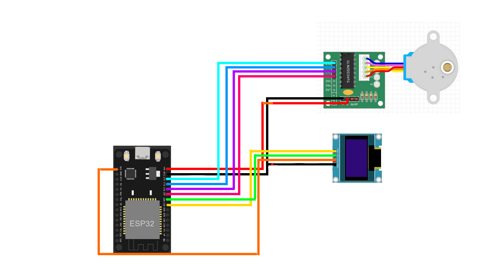

# ESP32-TrackingWithServo

ESP32-TrackingWithServo is a project designed to create a one-axis stabilization system. The system counteracts any movement of the base to keep a smartphone (or other object) mounted above it steady. The project achieves this using an Android app that communicates with an ESP32 over WiFi, which in turn controls a stepper motor to provide stabilization.

## Purpose

The primary goal of this project is to develop a simple and effective stabilization mechanism using affordable and widely available components. This can be useful in applications such as:
- Robotics
- Photography and videography
- Experimental setups requiring steady objects

## Schematic 

## Features

- **One-Axis Stabilization**: Automatically adjusts the position of the stepper motor to counteract base movements.
- **WiFi Communication**: Android app communicates with the ESP32 through a WiFi connection.
- **User Friendly**: Easy-to-use Android app for controlling and calibrating the system.
- **Stepper Motor Control**: Fine-grained control of motor movements for precise stabilization.

## Hardware Requirements

- ESP32 microcontroller
- Stepper motor (compatible with ESP32)
- Stepper Motor driver (ULN2003)
- Smartphone with Android OS
- Power supply for ESP32 and stepper motor
- Mounting hardware for the smartphone and stepper motor

## Software Requirements

- Arduino IDE (for programming the ESP32)
- Android Studio (for building the Android app, if modifications are needed)
- Required libraries for ESP32:
  - `WiFi.h`
  - `Stepper.h` or similar libraries for stepper motor control

## Usage

1. Power on the ESP32 and connect it to a WiFi network.
2. Open the Android app and connect it to the ESP32 using the provided IP address (Phone has to be connected to the same wifi network).
3. Place the smartphone on the stabilization platform.
4. The system will automatically counteract any movement of the base, keeping the smartphone steady.
5. Use the app to fine-tune the stabilization parameters if necessary.

## License

This project is licensed under the [MIT License](LICENSE).

## Acknowledgments

- Inspired by various DIY stabilization projects.
- Thanks to the open-source community for the libraries and resources used in this project.
